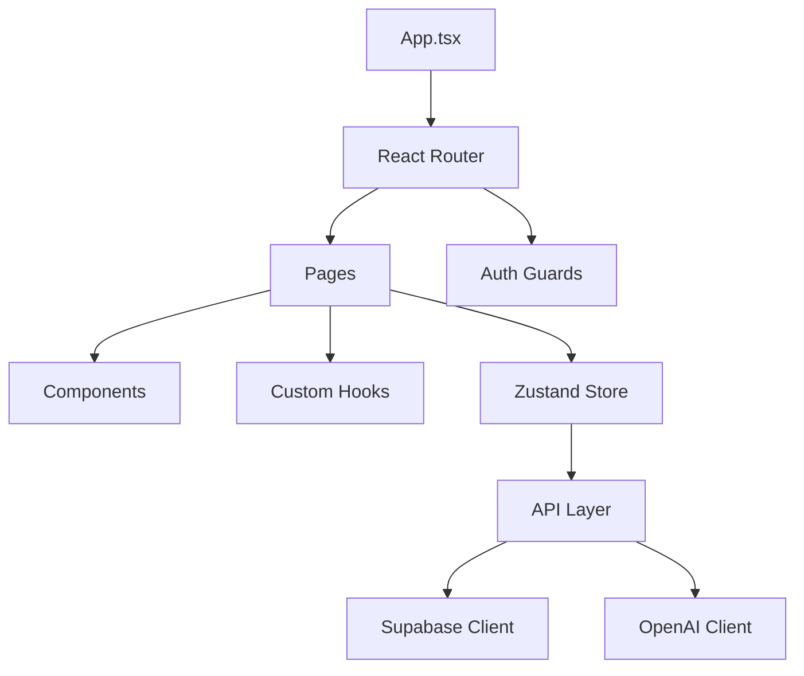
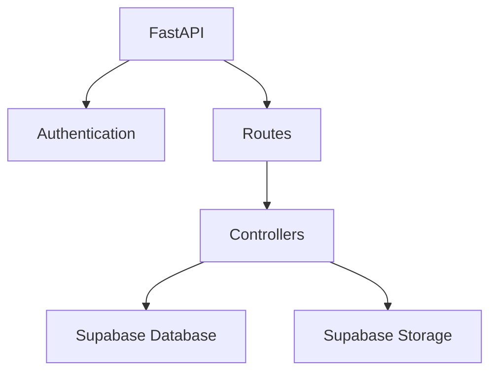
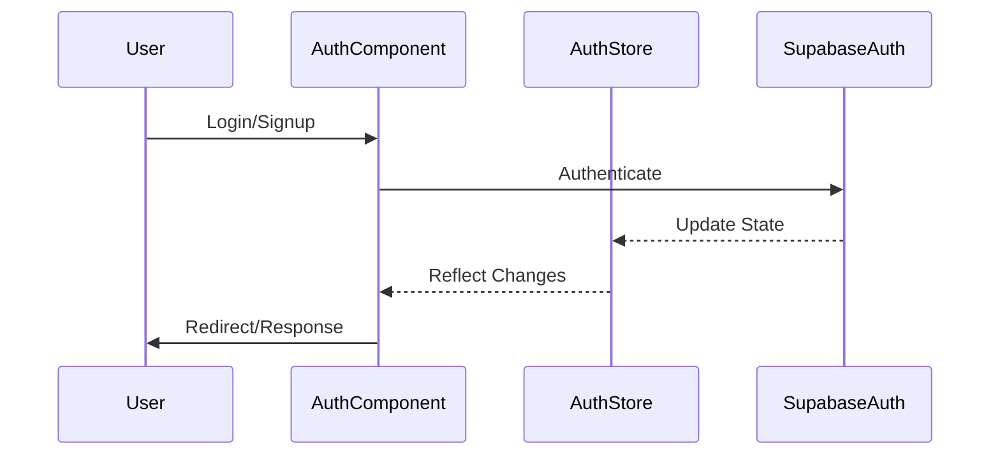
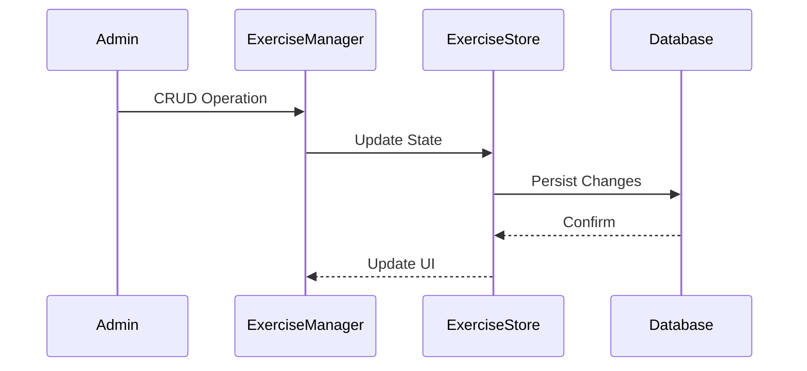
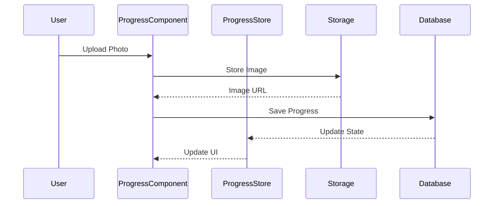
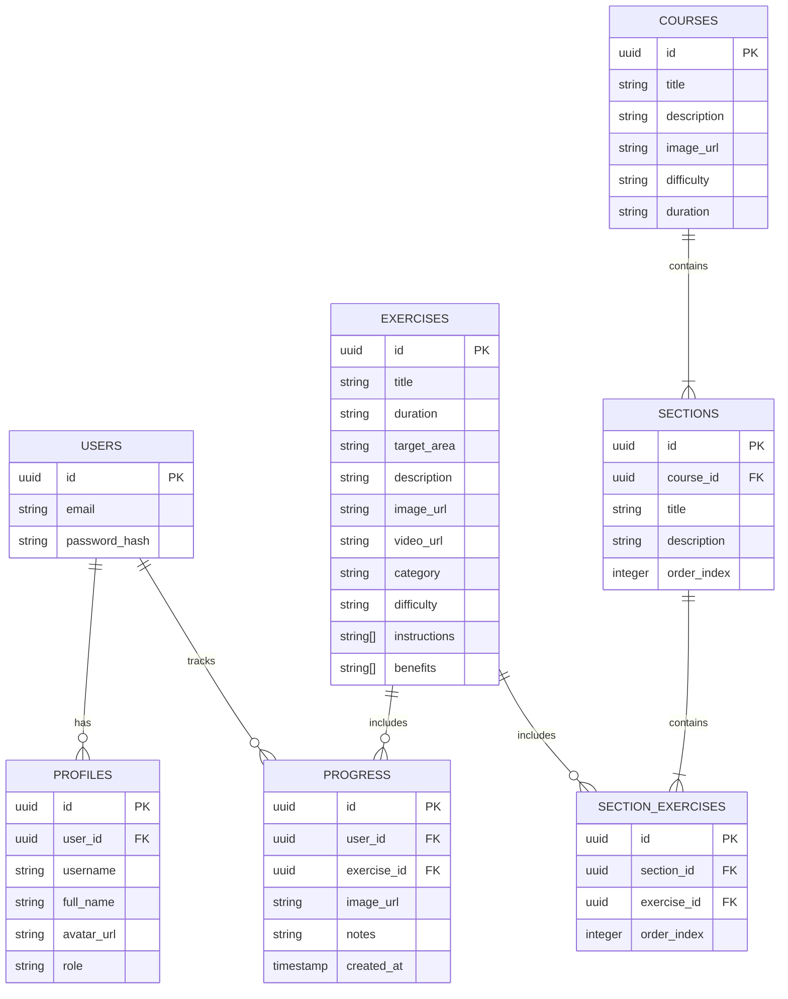
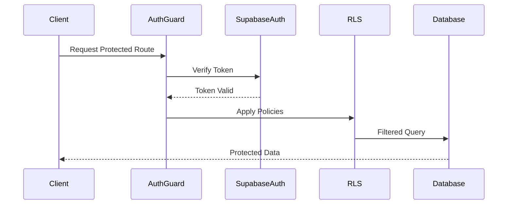
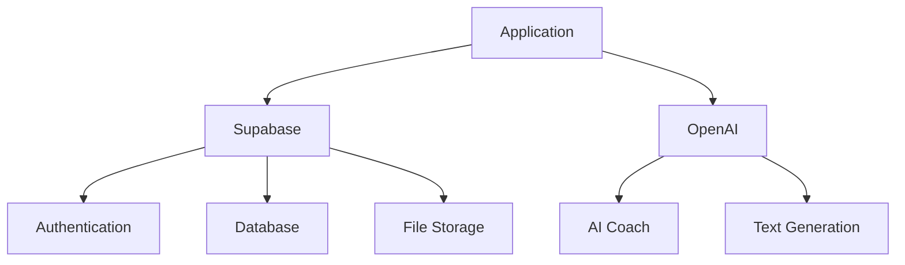

# Face Yoga Progress Tracker - Architecture Documentation

## System Architecture

The application follows a modern client-server architecture with the following key components:

### Frontend Architecture



### Backend Architecture



## Component Architecture

### Core Components

1. **Authentication Flow**


2. **Exercise Management**


3. **Progress Tracking**


## State Management Architecture

### Store Structure

```typescript
interface RootStore {
  auth: AuthStore;
  profile: ProfileStore;
  exercises: ExerciseStore;
  courses: CourseStore;
  progress: ProgressStore;
  chat: ChatStore;
}

interface AuthStore {
  user: User | null;
  loading: boolean;
  error: Error | null;
  signIn: (email: string, password: string) => Promise<void>;
  signOut: () => Promise<void>;
}

interface ProfileStore {
  profile: Profile | null;
  loading: boolean;
  error: Error | null;
  updateProfile: (data: Partial<Profile>) => Promise<void>;
}

// ... other store interfaces
```

## Database Architecture

### Entity Relationship Diagram



## Security Architecture

### Authentication Flow



### Row Level Security

```sql
-- Example RLS Policies
CREATE POLICY "Users can view own profile"
ON profiles FOR SELECT
USING (auth.uid() = user_id);

CREATE POLICY "Users can update own profile"
ON profiles FOR UPDATE
USING (auth.uid() = user_id);

CREATE POLICY "Admins can manage exercises"
ON exercises
USING (EXISTS (
    SELECT 1 FROM profiles
    WHERE profiles.user_id = auth.uid()
    AND profiles.role = 'admin'
));
```

## API Architecture

### RESTful Endpoints

```typescript
interface APIEndpoints {
  auth: {
    signIn: '/auth/signin' // POST
    signUp: '/auth/signup' // POST
    signOut: '/auth/signout' // POST
  }
  profiles: {
    get: '/profiles/:id' // GET
    update: '/profiles/:id' // PUT
    uploadAvatar: '/profiles/:id/avatar' // POST
  }
  exercises: {
    list: '/exercises' // GET
    create: '/exercises' // POST
    update: '/exercises/:id' // PUT
    delete: '/exercises/:id' // DELETE
  }
  progress: {
    list: '/progress' // GET
    create: '/progress' // POST
    delete: '/progress/:id' // DELETE
  }
  courses: {
    list: '/courses' // GET
    create: '/courses' // POST
    update: '/courses/:id' // PUT
    delete: '/courses/:id' // DELETE
    sections: '/courses/:id/sections' // GET, POST
  }
}
```

## Storage Architecture

### File Storage Structure

```
storage/
├── avatars/
│   └── {user_id}/
│       └── avatar.{ext}
├── progress/
│   └── {user_id}/
│       └── {timestamp}.{ext}
└── exercises/
    └── {exercise_id}.{ext}
```

## Integration Architecture

### Third-party Services



This architecture documentation provides a comprehensive overview of the system's structure and components. For specific implementation details, refer to the inline code documentation and the README.md file.